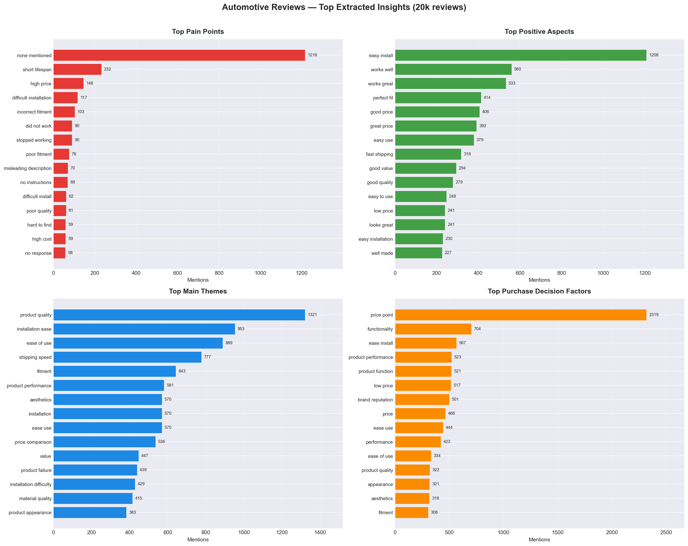
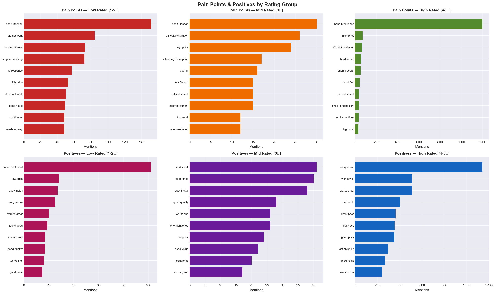

# P9.1 - Automotive Product Sentiment Analysis

**Course:** BSAN885 Advanced AI Analytics — Barton School of Business, WSU  
**Student:** Haribabu Ambati  
**Category:** Automotive Products (Amazon Reviews)  
**Reviews Analyzed:** 20,000  
**Date Range:** 2008–2009  

---

## Business Context

Acting as a data analyst helping a company decide whether to enter the Amazon Automotive 
products market. Analyzed 20,000 real customer reviews using LLMs to extract structured 
business insights — pain points, positive aspects, sentiment, and purchase decision factors.

---

## Key Findings

- **61% positive sentiment** across 20,000 reviews
- **Average rating: 3.97★** with steady improvement 2008→2009
- **Top pain point:** Short lifespan and product durability
- **Top positive:** Easy installation and good value
- **Best cluster:** Filters & Performance Parts (★4.46 avg, 1,063 reviews)
- **Worst cluster:** Product Quality & Fulfillment Failures (★1.68, 1,976 reviews)
- **Market recommendation:** Enter with simple mechanical parts — avoid complex electronics

---

## Pipeline
Raw TSV (99,996 reviews)
↓
Filter & Prepare (20,000 reviews)
↓
Parallel LLM Extraction (asyncio + aiohttp, 10 concurrent requests)
↓
Structured JSON per review (pain points, positives, sentiment, themes)
↓
Aggregate & Analyze (Counter, groupby, rating groups)
↓
Embedding + Clustering (OpenAI API → PCA → t-SNE → KMeans k=15)
↓
Temporal Trend Analysis (2008–2009 monthly)
↓
Top vs Bottom Product Comparison (LLM-powered)
↓
Executive Summary (LLM-generated business recommendations)
↓
Interactive Dashboard (Plotly Dash)

---

## Tech Stack

| Component | Technology |
|---|---|
| LLM Extraction | Gemini 2.5 Flash Lite via OpenRouter API |
| Parallel Processing | Python asyncio + aiohttp (10 concurrent) |
| Embeddings | OpenAI text-embedding-3-small via OpenRouter |
| Dimensionality Reduction | PCA (1536→50) + t-SNE (50→2) |
| Clustering | K-Means (k=15, silhouette-optimized) |
| Dashboard | Plotly Dash + Dash Bootstrap Components |
| Data Processing | Pandas, NumPy, scikit-learn |

---

## Visualizations

### Insights Overview — Top Pain Points, Positives, Themes, Factors

### Rating Group Comparison

---

## Project Files

| File | Description |
|---|---|
| `w397r285_Amazon_Automative_Sentiment_Analysis_BSAN885.ipynb` | Main analysis notebook |
| `Automotive_review_insights.json` | 20k LLM-extracted review insights |
| `Automotive_comprehensive_results.json` | All aggregated stats and findings |
| `Automotive_executive_summary.json` | LLM-generated business recommendations |
| `Automotive_product_comparison.json` | Top vs bottom product analysis |
| `Automotive_cluster_analyses.json` | 15 cluster themes and summaries |

---

## Cluster Summary (15 Clusters)

| Cluster | Theme | Size | Avg Rating |
|---|---|---|---|
| 0 | Product Fit and Installation | 2,241 | 4.27★ |
| 1 | Battery Maintenance & Charging | 1,523 | 3.98★ |
| 2 | Towing, Cargo & Accessories | 1,396 | 4.31★ |
| 3 | Motorcycle Protective Gear | 830 | 4.18★ |
| 4 | Gauges, Compressors & Fuel Caps | 1,178 | 3.87★ |
| 5 | Convenience & Utility Accessories | 1,545 | 4.19★ |
| 6 | Automotive Cleaning & Detailing | 1,566 | 4.30★ |
| 7 | Filters & Performance Parts | 1,063 | 4.46★ |
| 8 | Diagnostic Tools & Scanners | 894 | 4.39★ |
| 9 | Wiper Blade Replacements | 572 | 4.07★ |
| 10 | Lighting Performance | 1,066 | 3.84★ |
| 11 | Positive Experience & Delivery | 1,163 | 4.79★ |
| 12 | Quality & Fulfillment Failures | 1,976 | 1.68★ |
| 13 | Interior/Exterior Protection | 1,123 | 3.95★ |
| 14 | Diverse Automotive Accessories | 1,862 | 4.35★ |

---

## Executive Summary

The automotive products market presents a **strong opportunity** for new entrants focusing 
on simple, reliable mechanical parts with clear fitment specifications. Products like oil 
filters, hitch accessories, and cleaning supplies consistently receive 4-5 star ratings 
when they deliver on their core promise.

**Enter:** Filters, towing accessories, cleaning products, diagnostic tools  
**Avoid:** Electronic repair kits, solar gadgets, complex battery devices  
**Critical success factor:** Functional reliability over feature count
